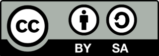

<H2>License:</H2>

This work is owned by the **[Nucleomics Core](https://www.nucleomics.be)**, the 'sequencing' facility of **[VIB](http://www.vib.be)**.

<b>This work is licensed under a Creative Commons Attribution-ShareAlike 3.0 Unported License</b> 

You are free to:

Share — copy and redistribute the material in any medium or format

Adapt — remix, transform, and build upon the material

for any purpose, even commercially.

Under the following terms: 

Attribution — You must give appropriate credit, provide a link to the license, and indicate if changes were made. You may do so in any reasonable manner, but not in any way that suggests the licensor endorses you or your use.

ShareAlike — If you remix, transform, or build upon the material, you must distribute your contributions under the same license as the original.

